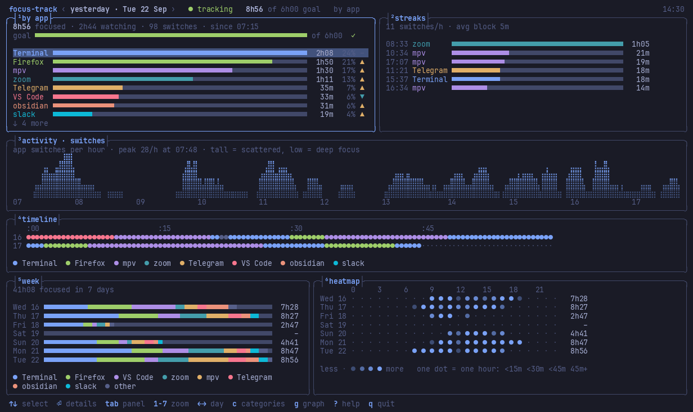

# focus-track

**See where your time goes on Hyprland.** A small recorder notes which window has focus, and a
btop-style dashboard shows your day. Everything stays on your machine.



- **Counts only real time**: idle, locked and suspended time is skipped; a playing video or call counts as *watching*.
- **Pages, privately**: time per website with its URL. Private/incognito windows are never recorded.
- **Your categories**: work, media, chat… by rules you write. No AI, no network, ever.
- **Kept safe**: nothing is ever deleted, and a verified backup is made every day.

## Install

Needs Hyprland. Everything else is optional (`pactl`, `notify-send`, `xdg-open`, see [Install](docs/install.md)).
**Pick one** of these; they are alternatives:

**Prebuilt binary**, any Linux, no Rust needed:

```sh
curl -fsSL https://raw.githubusercontent.com/sfmqrb/focus-track/main/install.sh | sh
```

**Arch Linux package**: [see Install](docs/install.md#arch-linux).

**From source**, if you have Rust:

```sh
cargo install --locked --git https://github.com/sfmqrb/focus-track
```

Then start recording and check it works (the installer prints the exact commands for your setup):

```sh
systemctl --user enable --now focus-track     # or: exec-once = focus-track daemon   in your Hyprland config
focus-track doctor
```

Something not working? See [Troubleshooting](docs/troubleshooting.md).

## Use

```sh
focus-track dashboard     # the live dashboard (press ? for help)
focus-track               # today at a glance
focus-track week          # the last 7 days
focus-track pages         # websites you visited
```

## More

- [Install](docs/install.md): verifying downloads, autostart without systemd, the Omarchy bar widget, uninstalling
- [Usage](docs/usage.md): every command, dashboard keys, how to read the charts
- [Configuration](docs/configuration.md): names, merging apps, categories, extra browsers
- [Troubleshooting](docs/troubleshooting.md): install problems, other browsers, no systemd
- [Privacy & security](SECURITY.md): exactly what is stored, where, and how to delete it

MIT license.
